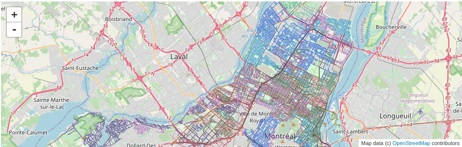

# Operational-Research-Project



# Setup

```
source demo.sh
```

# Architecture

```
* `src/`
  * `theory/` : a sub-tree dedicated to the study of the theoretical case 
  * `application/` : a sub-tree dedicated to the study of the real case of the city of Montreal 
* `AUTHORS`
* `README.md`
* `synthesis.pdf` : summary of the team's reflections 
* `LINKS` : link to the video presentation of the solution
* `source.sh` : a script running a demo of the solution 
```